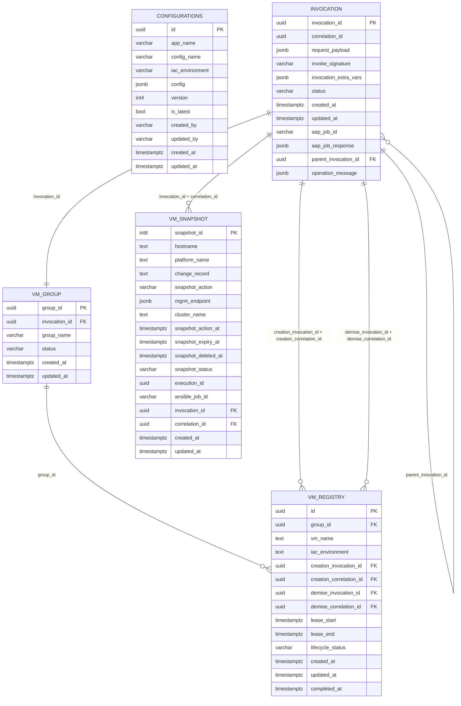

# Database Design Document

**Project:** VM Self-Service Platform (OpenShift Virtualization)  
**Schema Prefixes:** `platform`, `config`  
**Source:** Alembic migration `002_create_tables.py`  
**Version:** 2.0  
**Last Updated:** 2026-03-27  
**Status:** 🟢 Current

---

## Table of Contents

1. [Overview & Purpose](#1-overview--purpose)
2. [ERD – Entity Relationship Diagram](#2-erd--entity-relationship-diagram)
3. [Table Definitions](#3-table-definitions)
   - [config.configurations](#31-configconfigurations)
   - [platform.invocation](#32-platforminvocation)
   - [platform.vm_group](#33-platformvm_group)
   - [platform.vm_registry](#34-platformvm_registry)
   - [platform.vm_snapshot](#35-platformvm_snapshot)
4. [Constraints Summary](#4-constraints-summary)
5. [Indexes](#5-indexes)
6. [Triggers](#6-triggers)
7. [Design Notes](#7-design-notes)

---

## 1. Overview & Purpose

This document describes the relational database schema for the **VM Self-Service Platform** — a GitOps-driven system enabling teams to provision and manage virtual machines on OpenShift Virtualization (KubeVirt) via a FastAPI-backed API layer with a full GitOps approval workflow and Ansible Automation Platform (AAP) execution engine.

The database is organised into two schemas:

| Schema | Purpose |
|--------|---------|
| `config` | Versioned, environment-scoped configuration consumed at runtime by the API layer |
| `platform` | VM lifecycle state, invocation audit trail, group management, and snapshot operations |

### Responsibilities by Table

| Table | Responsibility |
|-------|---------------|
| `config.configurations` | Versioned configuration blobs per app, config name, and environment |
| `platform.invocation` | Central audit log for every API request — approval state, AAP job linkage, chained operations |
| `platform.vm_group` | Logical grouping of VMs tied to a single provisioning invocation |
| `platform.vm_registry` | Source of truth for each provisioned VM — lifecycle status, lease window, creation/demise tracking |
| `platform.vm_snapshot` | Tracks all snapshot operations against VMs — action state, AAP job, and expiry |

### Key Design Principles

- UUID primary keys on all tables (generated via `gen_random_uuid()`)
- All timestamps are `TIMESTAMPTZ` with `DEFAULT NOW()` — stored in UTC
- `JSONB` used for flexible payloads (request bodies, AAP responses, extra vars, mgmt endpoints)
- `invocation` uses a **composite unique key** `(invocation_id, correlation_id)` — referenced as a composite FK by `vm_registry` for both creation and demise events
- VM lifecycle is controlled by a `CHECK` constraint on `lifecycle_status`
- Config versioning via `is_latest` partial unique index ensures only one active version per `(app_name, config_name, iac_environment)`
- `updated_at` is maintained automatically via the `platform.set_updated_at_trg()` trigger function

---

## 2. ERD – Entity Relationship Diagram



---

## 3. Table Definitions

> **Conventions**
> - `PK` = Primary Key | `FK` = Foreign Key | `UQ` = Unique | `NN` = Not Null
> - All timestamps are `TIMESTAMPTZ NOT NULL DEFAULT NOW()` unless otherwise noted
> - Column lengths shown where defined in DDL (e.g. `VARCHAR(150)`, `VARCHAR(20)`)

---

### 3.1 `config.configurations`

Stores versioned, environment-scoped configuration for each application. The platform API reads the active version (`is_latest = TRUE`) at runtime. All previous versions are retained for audit, rollback, and point-in-time config reconstruction.

| Column | Type | Constraints | Description |
|--------|------|-------------|-------------|
| `id` | `UUID` | `PK`, `NN` | Surrogate primary key — uniquely identifies one version of a configuration record |
| `app_name` | `VARCHAR` | `NN` | The application this configuration belongs to (e.g. `vm-self-service`, `placement-engine`) |
| `config_name` | `VARCHAR` | `NN` | Logical name of the configuration block within the app (e.g. `cluster-defaults`, `approval-policy`, `placement-weights`) |
| `iac_environment` | `VARCHAR` | `NN` | Target environment scope: `dev`, `test`, `uat`, `prod`, or `global` |
| `config` | `JSONB` | `NN` | Full configuration payload as a structured JSON object. Supports nested keys, arrays, and Vault/Key Vault URI references. Indexed with GIN for efficient key-path queries |
| `version` | `INT4` | `NN`, default `1` | Monotonically increasing version counter per `(app_name, config_name, iac_environment)`. Incremented on every update |
| `is_latest` | `BOOL` | `NN`, default `TRUE` | Marks the currently active version. Enforced as a partial unique index — only one record per `(app_name, config_name, iac_environment)` may have `is_latest = TRUE` |
| `created_by` | `VARCHAR` | `NN` | Username or service account that created this configuration version |
| `updated_by` | `VARCHAR` | `NN` | Username or service account that last modified this record |
| `created_at` | `TIMESTAMPTZ` | `NN`, `DEFAULT NOW()` | Timestamp when this version was first created |
| `updated_at` | `TIMESTAMPTZ` | `NN`, `DEFAULT NOW()` | Timestamp of the last update to this record |

**Indexes:** *(see [Section 5](#5-indexes) for full detail)*
- `idx_conf_app_env` — `(app_name, iac_environment)`
- `idx_conf_app_name` — `(app_name, config_name, iac_environment)`
- `uq_configurations_latest_key` — `UNIQUE (app_name, config_name, iac_environment) WHERE is_latest = TRUE`
- `uq_configurations_version_key` — `UNIQUE (app_name, config_name, iac_environment, version)`
- `idx_conf_gin` — `GIN (config)` for JSONB key/value lookups

---

### 3.2 `platform.invocation`

The central audit and orchestration table. Every API call that triggers a VM operation creates an invocation record. The composite unique key `(invocation_id, correlation_id)` is referenced as a FK from `vm_registry` for both creation and demise events, ensuring end-to-end traceability.

| Column | Type | Constraints | Description |
|--------|------|-------------|-------------|
| `invocation_id` | `UUID` | `PK`, `NN` | Primary key — unique identifier for this invocation |
| `correlation_id` | `UUID` | `NN` | Correlation ID propagated across all services, logs, and AAP job extra vars for end-to-end tracing. Together with `invocation_id`, forms the composite unique key referenced by `vm_registry` |
| `request_payload` | `JSONB` | `NN` | Full inbound API request body as received. Preserves the original intent of the caller for audit, replay, and troubleshooting |
| `invoke_signature` | `VARCHAR(200)` | `NN` | A hash or structured signature identifying the type and target of the invocation (e.g. `provision:vm_group:team-alpha-dev`). Used for idempotency checks and deduplication |
| `invocation_extra_vars` | `JSONB` | nullable | Additional variables injected into the AAP workflow template as extra vars. May include placement decisions, config overrides, or approval metadata |
| `status` | `VARCHAR(150)` | `NN` | Current lifecycle state. Values: `pending`, `auto_approved`, `pr_raised`, `approved`, `rejected`, `in_progress`, `completed`, `failed` |
| `created_at` | `TIMESTAMPTZ` | `NN`, `DEFAULT NOW()` | Timestamp when the invocation was first received by the API |
| `updated_at` | `TIMESTAMPTZ` | `NN`, `DEFAULT NOW()` | Timestamp of the most recent status change |
| `aap_job_id` | `VARCHAR(20)` | nullable | The Ansible Automation Platform job ID returned after workflow template submission. Used to poll job status |
| `aap_job_response` | `JSONB` | nullable | Full AAP job response payload including status, output summary, and extra vars echo |
| `parent_invocation_id` | `UUID` | `FK → invocation.invocation_id`, nullable | Self-referencing FK. Populated when this invocation is a child spawned by a parent (e.g. a demise invocation triggered from a lease expiry job) |
| `operation_message` | `JSONB` | nullable | Structured result or error detail from the operation. Carries human-readable feedback, error codes, and partial success states back to the API caller |

**Constraints:**
- `invocation_pkey` — `PRIMARY KEY (invocation_id)`
- `uq_invocation_invocation_id_correlation_id` — `UNIQUE (invocation_id, correlation_id)` — this composite unique key is the FK target for `vm_registry` and `vm_snapshot`

---

### 3.3 `platform.vm_group`

Represents a logical grouping of VMs provisioned together as a single unit. Each group is created by exactly one invocation and can contain one or more VMs in `vm_registry`. Group names align with GitOps repository paths and ArgoCD Application names.

| Column | Type | Constraints | Description |
|--------|------|-------------|-------------|
| `group_id` | `UUID` | `PK`, `NN`, `DEFAULT gen_random_uuid()` | Surrogate primary key — unique identifier for this VM group |
| `invocation_id` | `UUID` | `NN` | The invocation that created this group. Links the group back to the original request payload, approval record, and AAP job |
| `group_name` | `VARCHAR(200)` | nullable | Human-readable name for this group (e.g. `team-alpha-dev`, `app-xyz-uat`). Used in GitOps repository folder paths and ArgoCD Application resource names. Nullable to allow group creation before name resolution |
| `status` | `VARCHAR(150)` | `NN` | Lifecycle state of the group. Values: `pending`, `active`, `decommissioning`, `decommissioned` |
| `created_at` | `TIMESTAMPTZ` | `NN`, `DEFAULT NOW()` | Timestamp when the group record was created |
| `updated_at` | `TIMESTAMPTZ` | `NN`, `DEFAULT NOW()` | Timestamp of the last status change or modification |

**Constraints:**
- `vm_group_pkey` — `PRIMARY KEY (group_id)`

---

### 3.4 `platform.vm_registry`

The source of truth for every VM provisioned by the platform. Tracks the full lifecycle from creation through to demise. Uses **two separate composite FKs** to `platform.invocation` — one for the creation event and one for the demise event — ensuring both provisioning and decommission operations are fully traceable to their authorising invocations.

| Column | Type | Constraints | Description |
|--------|------|-------------|-------------|
| `id` | `UUID` | `PK`, `NN`, `DEFAULT gen_random_uuid()` | Surrogate primary key — unique identifier for this VM record |
| `group_id` | `UUID` | `FK → vm_group.group_id`, `NN` | The VM group this VM belongs to. On group deletion, cascades to remove the VM record (`ON DELETE CASCADE`) |
| `vm_name` | `TEXT` | `NN`, `UQ` | The VM name as registered in OpenShift / KubeVirt. Must be globally unique (enforced by `uq_vm_registry_vm_name`). Also unique within `(vm_name, group_id, iac_environment)` |
| `iac_environment` | `TEXT` | `NN` | The IaC environment this VM is deployed to: `dev`, `test`, `uat`, `prod` |
| `creation_invocation_id` | `UUID` | `FK (composite)`, `NN` | The `invocation_id` of the provisioning invocation. Forms part of the composite FK to `platform.invocation (invocation_id, correlation_id)` |
| `creation_correlation_id` | `UUID` | `FK (composite)`, `NN` | The `correlation_id` of the provisioning invocation. Paired with `creation_invocation_id` as the composite FK to `platform.invocation` |
| `demise_invocation_id` | `UUID` | `FK (composite)`, nullable | The `invocation_id` of the decommission invocation. Null until a demise operation is initiated |
| `demise_correlation_id` | `UUID` | `FK (composite)`, nullable | The `correlation_id` of the decommission invocation. Paired with `demise_invocation_id` as the composite FK to `platform.invocation` |
| `lease_start` | `TIMESTAMPTZ` | nullable | Timestamp when the VM lease begins. VM is considered active and in-use from this point |
| `lease_end` | `TIMESTAMPTZ` | nullable | Timestamp when the VM lease expires. After this point, the VM is eligible for automated demise. Indexed for efficient expiry queries by the lease scheduler |
| `lifecycle_status` | `VARCHAR(150)` | `NN`, `CHECK` | Current lifecycle state. Constrained to: `Creating`, `Created`, `Demising`, `Demised` |
| `created_at` | `TIMESTAMPTZ` | `NN`, `DEFAULT NOW()` | Timestamp when this VM record was first inserted into the registry |
| `updated_at` | `TIMESTAMPTZ` | `NN`, `DEFAULT NOW()` | Timestamp of the last update — maintained automatically by trigger `trg_vm_registry_set_updated_at` |
| `completed_at` | `TIMESTAMPTZ` | nullable | Timestamp when the VM lifecycle was fully completed (status reached `Demised`). Null indicates the VM is still active |

**Constraints:**
- `vm_registry_lifecycle_status_chk` — `CHECK (lifecycle_status IN ('Creating', 'Created', 'Demising', 'Demised'))`
- `vm_registry_creation_invocation_fkey` — `FOREIGN KEY (creation_invocation_id, creation_correlation_id) REFERENCES platform.invocation (invocation_id, correlation_id) ON UPDATE NO ACTION ON DELETE NO ACTION`
- `vm_registry_demise_invocation_fkey` — `FOREIGN KEY (demise_invocation_id, demise_correlation_id) REFERENCES platform.invocation (invocation_id, correlation_id) ON UPDATE NO ACTION ON DELETE NO ACTION`
- `vm_registry_group_id_fkey` — `FOREIGN KEY (group_id) REFERENCES platform.vm_group (group_id) ON UPDATE NO ACTION ON DELETE CASCADE`
- `uq_vm_registry_vm_name` — `UNIQUE (vm_name)`
- Composite unique — `UNIQUE (vm_name, group_id, iac_environment)`

**Triggers:**
- `trg_vm_registry_set_updated_at` — fires `BEFORE UPDATE`, executes `platform.set_updated_at_trg()` to auto-maintain `updated_at`

---

### 3.5 `platform.vm_snapshot`

Tracks all snapshot operations performed against VMs. A snapshot may be triggered pre-demise, on-demand, or by a scheduled policy. Each snapshot record links back to the authorising invocation via the composite FK `(invocation_id, correlation_id)`.

| Column | Type | Constraints | Description |
|--------|------|-------------|-------------|
| `snapshot_id` | `INT8` | `PK`, `NN` | Surrogate primary key — auto-incrementing integer identifier for this snapshot record |
| `hostname` | `TEXT` | `NN` | The hostname of the VM being snapshotted, as known to the IaC/AAP layer |
| `platform_name` | `TEXT` | `NN` | The OpenShift/KubeVirt platform name where this VM resides (e.g. cluster name or platform identifier) |
| `change_record` | `TEXT` | nullable | ITSM change record reference (e.g. ServiceNow CHG number) associated with this snapshot operation |
| `snapshot_action` | `VARCHAR` | `NN` | The type of snapshot operation requested. Values: `create`, `delete`, `restore`, `extend` |
| `mgmt_endpoint` | `JSONB` | nullable | Management endpoint details for the target VM (host, port, credentials reference). Stored as JSONB to support varying endpoint schemas across clusters |
| `cluster_name` | `TEXT` | `NN` | The name of the OpenShift cluster on which the snapshot operation is executed |
| `snapshot_action_at` | `TIMESTAMPTZ` | nullable | Timestamp when the snapshot action was executed or is scheduled to execute |
| `snapshot_expiry_at` | `TIMESTAMPTZ` | nullable | Timestamp when this snapshot is scheduled to expire and be automatically deleted |
| `snapshot_deleted_at` | `TIMESTAMPTZ` | nullable | Timestamp when the snapshot was actually deleted. Null if the snapshot still exists |
| `snapshot_status` | `VARCHAR` | `NN` | Current status of the snapshot operation. Values: `pending`, `in_progress`, `completed`, `failed`, `expired`, `deleted` |
| `execution_id` | `UUID` | nullable | Internal execution trace ID for this snapshot operation, used for correlating logs across the API and AAP layers |
| `ansible_job_id` | `VARCHAR` | nullable | The AAP / Ansible job ID for the snapshot workflow execution. Used to poll job status and retrieve results |
| `invocation_id` | `UUID` | `FK (composite)`, `NN` | The `invocation_id` of the authorising invocation. Forms part of the composite FK to `platform.invocation (invocation_id, correlation_id)` |
| `correlation_id` | `UUID` | `FK (composite)`, `NN` | The `correlation_id` of the authorising invocation. Paired with `invocation_id` for full request tracing |
| `created_at` | `TIMESTAMPTZ` | `NN`, `DEFAULT NOW()` | Timestamp when this snapshot record was created |
| `updated_at` | `TIMESTAMPTZ` | `NN`, `DEFAULT NOW()` | Timestamp of the last update — maintained automatically by trigger `trg_vm_snapshot_set_updated_at` |

**Triggers:**
- `trg_vm_snapshot_set_updated_at` — fires `BEFORE UPDATE`, executes `platform.set_updated_at_trg()` to auto-maintain `updated_at`

---

## 4. Constraints Summary

| Constraint Name | Table | Type | Definition |
|---|---|---|---|
| `invocation_pkey` | `platform.invocation` | PRIMARY KEY | `(invocation_id)` |
| `uq_invocation_invocation_id_correlation_id` | `platform.invocation` | UNIQUE | `(invocation_id, correlation_id)` |
| `vm_group_pkey` | `platform.vm_group` | PRIMARY KEY | `(group_id)` |
| `vm_registry_lifecycle_status_chk` | `platform.vm_registry` | CHECK | `lifecycle_status IN ('Creating', 'Created', 'Demising', 'Demised')` |
| `vm_registry_creation_invocation_fkey` | `platform.vm_registry` | FOREIGN KEY | `(creation_invocation_id, creation_correlation_id)` → `invocation(invocation_id, correlation_id)` |
| `vm_registry_demise_invocation_fkey` | `platform.vm_registry` | FOREIGN KEY | `(demise_invocation_id, demise_correlation_id)` → `invocation(invocation_id, correlation_id)` |
| `vm_registry_group_id_fkey` | `platform.vm_registry` | FOREIGN KEY | `(group_id)` → `vm_group(group_id)` ON DELETE CASCADE |
| `uq_vm_registry_vm_name` | `platform.vm_registry` | UNIQUE | `(vm_name)` |
| *(unnamed)* | `platform.vm_registry` | UNIQUE | `(vm_name, group_id, iac_environment)` |

---

## 5. Indexes

### `config.configurations`

| Index Name | Type | Columns | Notes |
|---|---|---|---|
| `idx_conf_app_env` | BTREE | `(app_name, iac_environment)` | Fast lookup by app and environment |
| `idx_conf_app_name` | BTREE | `(app_name, config_name, iac_environment)` | Fast lookup of a specific config block |
| `uq_configurations_latest_key` | UNIQUE (partial) | `(app_name, config_name, iac_environment) WHERE is_latest = TRUE` | Enforces exactly one active version per config block |
| `uq_configurations_version_key` | UNIQUE | `(app_name, config_name, iac_environment, version)` | Prevents duplicate version numbers per config block |
| `idx_conf_gin` | GIN | `(config)` | Enables efficient JSONB key/value/path queries on the config payload |

### `platform.invocation`

| Index Name | Type | Columns | Notes |
|---|---|---|---|
| `uq_invocation_invocation_id_correlation_id` | UNIQUE | `(invocation_id, correlation_id)` | Composite unique key — target for composite FKs in `vm_registry` and `vm_snapshot` |
| *(recommended)* | BTREE | `(status)` | Filter active/pending invocations |
| *(recommended)* | BTREE | `(parent_invocation_id)` | Traverse invocation trees |
| *(recommended)* | BTREE | `(aap_job_id)` | Look up invocation by AAP job |

### `platform.vm_registry`

| Index Name | Type | Columns | Notes |
|---|---|---|---|
| `uq_vm_registry_vm_name` | UNIQUE | `(vm_name)` | Globally unique VM names |
| *(unnamed)* | UNIQUE | `(vm_name, group_id, iac_environment)` | Unique within group/environment scope |
| *(recommended)* | BTREE | `(lifecycle_status)` | Filter by lifecycle state |
| *(recommended)* | BTREE | `(lease_end)` | Efficient lease expiry scheduling queries |
| *(recommended)* | BTREE | `(group_id)` | Join to `vm_group` |

---

## 6. Triggers

All `updated_at` columns are maintained automatically by a shared trigger function, removing the need for application-layer timestamp management.

| Trigger Name | Table | Event | Function |
|---|---|---|---|
| `trg_vm_registry_set_updated_at` | `platform.vm_registry` | `BEFORE UPDATE FOR EACH ROW` | `platform.set_updated_at_trg()` |
| `trg_vm_snapshot_set_updated_at` | `platform.vm_snapshot` | `BEFORE UPDATE FOR EACH ROW` | `platform.set_updated_at_trg()` |

**Trigger Function:**
```sql
-- Shared trigger function (defined in platform schema)
CREATE OR REPLACE FUNCTION platform.set_updated_at_trg()
RETURNS TRIGGER AS $$
BEGIN
    NEW.updated_at = NOW();
    RETURN NEW;
END;
$$ LANGUAGE plpgsql;
```

> It is recommended to apply this trigger to `platform.invocation` and `platform.vm_group` as well for consistency, if not already present.

---

## 7. Design Notes

### Composite Foreign Keys on `vm_registry`
`vm_registry` references `platform.invocation` twice — once for the creation event and once for the demise event — using the composite key `(invocation_id, correlation_id)`. This design ensures that every lifecycle transition (creation and decommission) is tied to a fully auditable, correlation-traceable invocation record, not just an opaque UUID. The composite key also means a `vm_registry` row cannot be linked to an invocation that doesn't have a valid `correlation_id`.

### `lifecycle_status` CHECK Constraint
The four allowed values — `Creating`, `Created`, `Demising`, `Demised` — are enforced at the database level via a `CHECK` constraint on `vm_registry`. This prevents invalid state transitions being persisted regardless of API-layer validation. The API layer should additionally enforce valid state machine transitions (e.g. `Creating → Created`, `Created → Demising`, `Demising → Demised`).

### Configuration Versioning with Partial Unique Index
The `uq_configurations_latest_key` partial unique index (`WHERE is_latest = TRUE`) is the enforcement mechanism for config versioning. When updating a config, the pattern is:
1. `UPDATE` the existing row to set `is_latest = FALSE`
2. `INSERT` a new row with `version + 1` and `is_latest = TRUE`

The GIN index on `config` supports efficient JSONB queries such as looking up all configs containing a specific key or value, useful for the placement config library.

### `invoke_signature` on `invocation`
This `VARCHAR(200)` field carries a structured identifier for the type and target of the invocation (e.g. a hash of the operation type + target resource). It enables idempotency checks at the API layer — an incoming request can be checked against recent invocations with the same signature to prevent duplicate submissions.

### `invocation_extra_vars` vs `request_payload`
- `request_payload` — the raw API request body as submitted by the caller. Immutable after creation.
- `invocation_extra_vars` — the resolved, enriched variable set passed to the AAP workflow template. May include placement decisions, config values, and approval metadata computed after the request was received.

### Snapshot Lifecycle
`vm_snapshot` tracks the full lifecycle of a snapshot operation independently of `vm_registry`. A snapshot may outlive the VM it was taken from (e.g. a pre-demise snapshot retained for 30 days). The `snapshot_expiry_at` and `snapshot_deleted_at` columns support a scheduled cleanup job that identifies and removes expired snapshots via AAP.

### Cascade Behaviour
`vm_registry_group_id_fkey` is defined with `ON DELETE CASCADE` — deleting a `vm_group` record will cascade to delete all associated `vm_registry` rows. All other FKs use `ON DELETE NO ACTION`, requiring explicit handling of related records before deletion.

---

*This is a living document. Update constraints, indexes, and descriptions as the schema evolves. The Alembic migration file `002_create_tables.py` is the authoritative source for DDL.*
