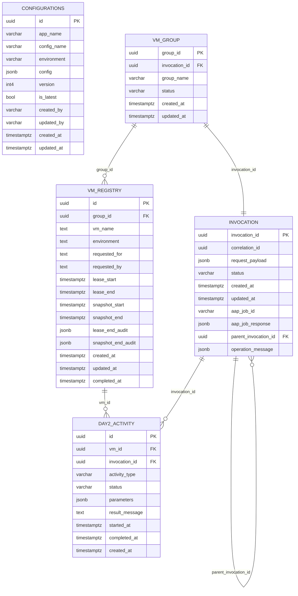

# Database Design Document

**Project:** VM Self-Service Platform (OpenShift Virtualization)  
**Schema Prefixes:** `platform`, `config`  
**Version:** 1.0  
**Last Updated:** 2026-03-25  
**Status:** 🟢 Current

---

## Table of Contents

1. [Overview & Purpose](#1-overview--purpose)
2. [ERD – Entity Relationship Diagram](#2-erd--entity-relationship-diagram)
3. [Table Definitions](#3-table-definitions)
   - [config.configurations](#31-configconfigurations)
   - [platform.invocation](#32-platforminvocation)
   - [platform.vm_registry](#33-platformvm_registry)
   - [platform.vm_group](#34-platformvm_group)
   - [platform.day2_activity](#35-platformday2_activity)
4. [Relationship Summary](#4-relationship-summary)
5. [Design Notes](#5-design-notes)

---

## 1. Overview & Purpose

This document describes the relational database schema for the **VM Self-Service Platform** — a GitOps-driven system enabling teams to provision and manage virtual machines on OpenShift Virtualization (KubeVirt) via a FastAPI-backed API layer with a full approval workflow.

The database is organised into two schemas:

| Schema | Purpose |
|--------|---------|
| `config` | Stores versioned platform and application configuration consumed at runtime by the API layer |
| `platform` | Stores all VM lifecycle state, invocation history, group management, and day-2 operations |

### Responsibilities by Table

| Table | Responsibility |
|-------|---------------|
| `config.configurations` | Versioned, environment-scoped configuration blobs per application |
| `platform.invocation` | Full audit trail of every API request, AAP job linkage, and approval state |
| `platform.vm_registry` | Source of truth for provisioned VM state, lease windows, and snapshot lifecycle |
| `platform.vm_group` | Logical grouping of VMs, linked to the originating invocation |
| `platform.day2_activity` | Post-provisioning operations (start, stop, resize, snapshot, etc.) |

### Key Design Principles

- Surrogate UUID primary keys on all tables
- All timestamps stored as `TIMESTAMPTZ` (UTC)
- `jsonb` used for flexible payloads (request bodies, AAP responses, audit trails)
- Versioned config via `version` + `is_latest` flag — enables point-in-time config snapshots
- Self-referencing `parent_invocation_id` on `invocation` supports chained/child operations
- Lease and snapshot lifecycle tracked as first-class fields on `vm_registry`

---

## 2. ERD – Entity Relationship Diagram

---

## 3. Table Definitions

> **Conventions**
> - `PK` = Primary Key | `FK` = Foreign Key | `UQ` = Unique | `NN` = Not Null
> - All timestamps are `TIMESTAMPTZ` (stored in UTC)
> - `jsonb` columns allow flexible, schema-less payloads with PostgreSQL indexing support

---

### 3.1 `config.configurations`

Stores versioned, environment-scoped configuration for each application. The platform API layer reads the active config (`is_latest = true`) at runtime; previous versions are retained for audit and rollback.

| Column | Type | Constraints | Description |
|--------|------|-------------|-------------|
| `id` | `UUID` | `PK`, `NN` | Surrogate primary key — uniquely identifies a configuration version record |
| `app_name` | `VARCHAR` | `NN` | The application this configuration belongs to (e.g. `vm-self-service`, `placement-engine`) |
| `config_name` | `VARCHAR` | `NN` | Logical name of the configuration block (e.g. `cluster-defaults`, `approval-policy`) |
| `environment` | `VARCHAR` | `NN` | Target environment scope: `dev`, `test`, `uat`, `prod`, or `global` |
| `config` | `JSONB` | `NN` | The full configuration payload as a JSON object. Supports nested keys, arrays, and Key Vault URI references |
| `version` | `INT4` | `NN`, default `1` | Monotonically increasing version number per `(app_name, config_name, environment)` combination |
| `is_latest` | `BOOL` | `NN`, default `true` | Flags the current active version. Only one record per `(app_name, config_name, environment)` should be `true` at any time |
| `created_by` | `VARCHAR` | `NN` | Username or service account that created this configuration version |
| `updated_by` | `VARCHAR` | `NN` | Username or service account that last modified this record |
| `created_at` | `TIMESTAMPTZ` | `NN` | Timestamp when this version was first created |
| `updated_at` | `TIMESTAMPTZ` | `NN` | Timestamp of the last update to this record |

**Indexes:**
- `idx_config_app_env` on `(app_name, environment)` where `is_latest = true`
- `idx_config_is_latest` on `(is_latest)`

**Notes:**
- When a config is updated, the existing row's `is_latest` should be set to `false`, and a new row inserted with an incremented `version` and `is_latest = true`
- PostgreSQL `LISTEN/NOTIFY` can be used on this table to push live config updates to running API workers without restart

---

### 3.2 `platform.invocation`

The central audit and orchestration table. Every API call that triggers a VM operation — provisioning, day-2, or deletion — creates an invocation record. AAP (Ansible Automation Platform) job linkage and chained/child operations are tracked here.

| Column | Type | Constraints | Description |
|--------|------|-------------|-------------|
| `invocation_id` | `UUID` | `PK`, `NN` | Surrogate primary key — unique identifier for this invocation |
| `correlation_id` | `UUID` | `NN` | Correlation identifier propagated across all services and logs for end-to-end request tracing (maps to `X-Correlation-ID` / `X-Invocation-ID` headers) |
| `request_payload` | `JSONB` | `NN` | Full inbound API request body as received. Preserves the original intent of the caller for audit and replay purposes |
| `status` | `VARCHAR` | `NN` | Current lifecycle state of this invocation. Values: `pending`, `auto_approved`, `pr_raised`, `approved`, `rejected`, `in_progress`, `completed`, `failed` |
| `created_at` | `TIMESTAMPTZ` | `NN` | Timestamp when the invocation was first received by the API |
| `updated_at` | `TIMESTAMPTZ` | `NN` | Timestamp of the most recent status transition |
| `aap_job_id` | `VARCHAR` | | The Ansible Automation Platform job ID returned after submitting the workflow template. Used to poll job status and retrieve results |
| `aap_job_response` | `JSONB` | | Full AAP job response payload. Includes status, extra vars, and output summary returned by the AAP API |
| `parent_invocation_id` | `UUID` | `FK → invocation.invocation_id` | Self-referencing FK. Populated when this invocation is a child operation spawned by a parent (e.g. a day-2 activity triggered from a provisioning flow) |
| `operation_message` | `JSONB` | | Structured result or error detail from the operation. Used for human-readable feedback, error codes, and partial success states |

**Indexes:**
- `idx_invocation_correlation_id` on `(correlation_id)`
- `idx_invocation_status` on `(status)`
- `idx_invocation_parent_id` on `(parent_invocation_id)`
- `idx_invocation_aap_job_id` on `(aap_job_id)`

**Notes:**
- `correlation_id` is distinct from `invocation_id` — the same correlation ID may span multiple invocations (e.g. initial request + retry)
- `parent_invocation_id` enables a simple tree structure for chained operations without a separate relationship table

---

### 3.3 `platform.vm_registry`

The source of truth for every VM provisioned by the platform. Tracks ownership, environment, lease lifecycle (when the VM is active), and snapshot lifecycle (when a snapshot exists).

| Column | Type | Constraints | Description |
|--------|------|-------------|-------------|
| `id` | `UUID` | `PK`, `NN` | Surrogate primary key — unique identifier for this VM record |
| `group_id` | `UUID` | `FK → vm_group.group_id`, `NN` | The VM group this VM belongs to. Determines cluster placement and shared configuration |
| `vm_name` | `TEXT` | `NN` | The name of the VM as registered in OpenShift / KubeVirt. Should match the `VirtualMachine` resource name in the target namespace |
| `environment` | `TEXT` | `NN` | Deployment environment: `dev`, `test`, `uat`, `prod` |
| `requested_for` | `TEXT` | `NN` | The user or team on whose behalf the VM was provisioned (the beneficiary / consumer) |
| `requested_by` | `TEXT` | `NN` | The user or service account that submitted the provisioning request (the requester / submitter) |
| `lease_start` | `TIMESTAMPTZ` | | Timestamp when the VM lease period begins. The VM is considered active and billable from this point |
| `lease_end` | `TIMESTAMPTZ` | | Timestamp when the VM lease expires. After this point, the VM is eligible for automated decommission |
| `snapshot_start` | `TIMESTAMPTZ` | | Timestamp when a VM snapshot was initiated (e.g. pre-decommission snapshot) |
| `snapshot_end` | `TIMESTAMPTZ` | | Timestamp when the snapshot operation completed |
| `lease_end_audit` | `JSONB` | | Audit record captured at lease expiry. Records VM state, decommission actions taken, and confirmation of deletion or extension |
| `snapshot_end_audit` | `JSONB` | | Audit record captured at snapshot completion. Records snapshot name, storage location, size, and outcome |
| `created_at` | `TIMESTAMPTZ` | `NN` | Timestamp when this VM record was first created in the registry |
| `updated_at` | `TIMESTAMPTZ` | `NN` | Timestamp of the last update to this VM record |
| `completed_at` | `TIMESTAMPTZ` | | Timestamp when the VM lifecycle was fully completed (decommissioned, deleted, or handed over). Null = VM still active |

**Indexes:**
- `idx_vm_registry_group_id` on `(group_id)`
- `idx_vm_registry_environment` on `(environment)`
- `idx_vm_registry_lease_end` on `(lease_end)` — supports lease expiry scheduling queries
- `idx_vm_registry_vm_name` on `(vm_name)`

**Notes:**
- A VM with `completed_at IS NULL` is considered active
- `lease_start` / `lease_end` and `snapshot_start` / `snapshot_end` are first-class columns (not embedded in JSONB) to allow efficient range queries by the lease expiry scheduler
- `lease_end_audit` and `snapshot_end_audit` capture a point-in-time JSONB snapshot of the operation outcome for traceability without requiring joins

---

### 3.4 `platform.vm_group`

Represents a logical grouping of VMs, typically corresponding to an application stack, team workspace, or cluster placement unit. Each group is created as part of an invocation and can contain one or more VMs in `vm_registry`.

| Column | Type | Constraints | Description |
|--------|------|-------------|-------------|
| `group_id` | `UUID` | `PK`, `NN` | Surrogate primary key — unique identifier for this VM group |
| `invocation_id` | `UUID` | `FK → invocation.invocation_id`, `NN` | The invocation that created this group. Links the group back to the original request payload and approval record |
| `group_name` | `VARCHAR` | `NN` | Human-readable name for this group (e.g. `team-alpha-dev`, `app-xyz-uat`). Used in GitOps repository paths and ArgoCD Application names |
| `status` | `VARCHAR` | `NN` | Current lifecycle status of the group. Values: `pending`, `active`, `decommissioning`, `decommissioned` |
| `created_at` | `TIMESTAMPTZ` | `NN` | Timestamp when the group record was created |
| `updated_at` | `TIMESTAMPTZ` | `NN` | Timestamp of the last status change or modification |

**Indexes:**
- `idx_vm_group_invocation_id` on `(invocation_id)`
- `idx_vm_group_status` on `(status)`

**Notes:**
- `vm_group` is created first during a provisioning invocation; `vm_registry` records are then created and linked to the group
- `group_name` should align with the GitOps repository folder structure (e.g. `clusters/<cluster>/<group_name>/`)

---

### 3.5 `platform.day2_activity`

Records individual day-2 operations performed on a VM after initial provisioning. Examples include start, stop, restart, resize, snapshot request, and console access. Each activity is linked to both the target VM and the invocation that authorised it.

| Column | Type | Constraints | Description |
|--------|------|-------------|-------------|
| `id` | `UUID` | `PK`, `NN` | Surrogate primary key |
| `vm_id` | `UUID` | `FK → vm_registry.id`, `NN` | The VM this activity targets |
| `invocation_id` | `UUID` | `FK → invocation.invocation_id` | The invocation that authorised or triggered this day-2 operation |
| `activity_type` | `VARCHAR` | `NN` | Type of day-2 operation: `start`, `stop`, `restart`, `resize`, `snapshot`, `console`, `extend_lease`, `delete` |
| `status` | `VARCHAR` | `NN` | Execution state: `queued`, `in_progress`, `completed`, `failed` |
| `parameters` | `JSONB` | | Activity-specific input parameters. For `resize`: new CPU/memory values. For `snapshot`: name and retention period. For `extend_lease`: new `lease_end` timestamp |
| `result_message` | `TEXT` | | Human-readable outcome description or error detail returned from AAP or KubeVirt |
| `started_at` | `TIMESTAMPTZ` | | Timestamp when execution of the activity began |
| `completed_at` | `TIMESTAMPTZ` | | Timestamp when the activity finished (success or failure) |
| `created_at` | `TIMESTAMPTZ` | `NN` | Timestamp when this activity record was created |

**Indexes:**
- `idx_day2_vm_id` on `(vm_id)`
- `idx_day2_invocation_id` on `(invocation_id)`
- `idx_day2_activity_type` on `(activity_type)`
- `idx_day2_status` on `(status)`

**Notes:**
- Uses Pydantic v2 discriminated unions on `activity_type` at the API layer to validate `parameters` per activity type
- Python 3.10+ `match/case` pattern matching routes each `activity_type` to the appropriate AAP workflow template

---

## 4. Relationship Summary

| Relationship | Type | Description |
|---|---|---|
| `vm_group` → `vm_registry` | One-to-Many | A group contains one or more VMs |
| `vm_group` → `invocation` | One-to-One | Each group is created by exactly one invocation |
| `invocation` → `invocation` | Self-referencing One-to-Many | An invocation can spawn child invocations via `parent_invocation_id` |
| `vm_registry` → `day2_activity` | One-to-Many | A VM can have many day-2 operations over its lifetime |
| `invocation` → `day2_activity` | One-to-Many | An invocation can authorise one or more day-2 activities |

---

## 5. Design Notes

### Configuration Versioning
The `config.configurations` table uses a `version` + `is_latest` pattern rather than a single mutable row. This ensures that an in-flight invocation always references the config active at the time it was submitted, even if the config is updated mid-flight. PostgreSQL `LISTEN/NOTIFY` on this table enables live config sync to running API workers.

### Lease Lifecycle Management
The `lease_start` / `lease_end` columns on `vm_registry` are first-class timestamp fields (not buried in JSONB) to support efficient range queries by a scheduled decommission job. VMs approaching `lease_end` can be identified with a simple index scan and trigger automated decommission invocations.

### AAP Job Traceability
`aap_job_id` and `aap_job_response` on `invocation` provide full traceability between platform API requests and the Ansible Automation Platform jobs that execute them. The full AAP response is stored as `jsonb` to preserve structured output from complex workflow templates.

### Correlation & Distributed Tracing
`correlation_id` on `invocation` is propagated via HTTP headers (`X-Correlation-ID` / `X-Invocation-ID`) across all downstream service calls and AAP job extra vars, enabling end-to-end request tracing in OpenTelemetry and application logs across the platform.

### Chained Operations
`parent_invocation_id` (self-referencing FK on `invocation`) enables a simple parent-child tree for chained operations (e.g. a decommission invocation spawned by a lease expiry job) without requiring a separate relationship table.

---

*This is a living document. Update column descriptions, constraints, and indexes as the schema evolves during implementation.*
